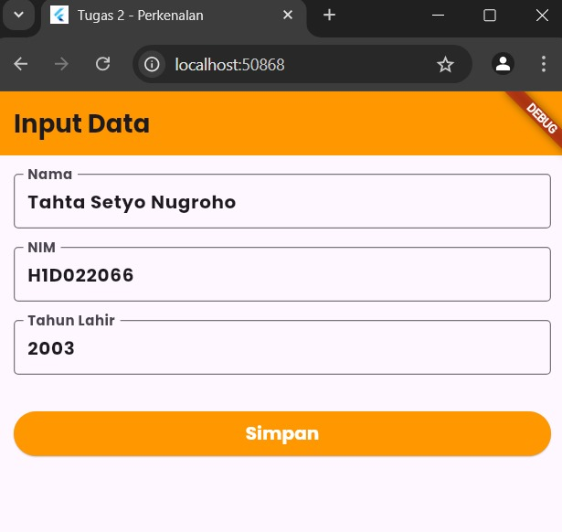
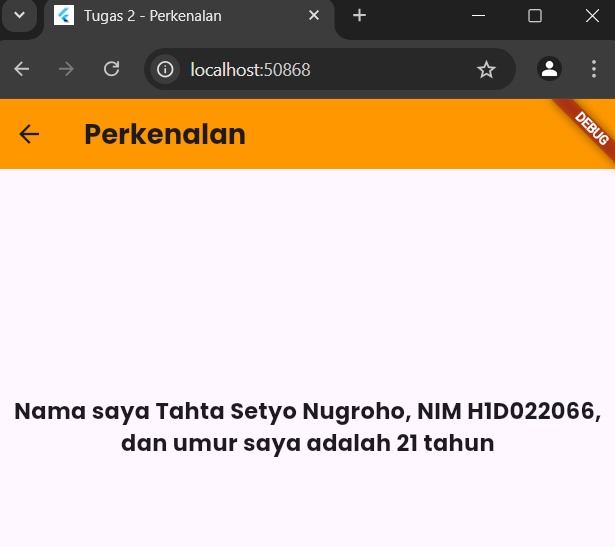

# Tugas Pertemuan 2

Fork dan clone repository ini, lalu jalankan perintah 
```
flutter pub get
```
Buatlah tampilan form yang berisi nama, nim, dan tahun lahir pada file `ui/form_data.dart`, lalu buatlah tampilan hasil dari input data tersebut pada file `ui/tampil_data.dart`

JELASKAN PROSES PASSING DATA DARI FORM MENUJU TAMPILAN DENGAN FILE `README.md`

Buat tampilan semenarik mungkin untuk dilihat.


Berikut adalah langkah-langkah passing data dari form ke tampilan yang telah diparafrasekan:

1. **Input Data di Form (FormData):**  
   FormData digunakan untuk menerima input dari pengguna, seperti nama, nim, dan tahun. Input ini diambil melalui `TextEditingController` yang berfungsi mengelola nilai yang dimasukkan ke dalam `TextField`.

2. **Mengambil Input dari Pengguna:**  
   Di dalam form, terdapat tiga `TextField` yang masing-masing terhubung dengan controller (`_namaController`, `_nimController`, `_tahunController`) untuk menangkap input dari pengguna.

3. **Mengirim Data dengan Navigator:**  
   Ketika pengguna menekan tombol "Simpan", data yang diinput akan dikirim ke widget lain, yaitu `TampilData`, dengan menggunakan metode `Navigator.push()`. Data ini dikirimkan sebagai argumen ke konstruktor `TampilData`.

4. **Menampilkan Data:**  
   Kelas `TampilData` yang merupakan `StatelessWidget` menerima data melalui konstruktor, seperti `nama` dan `nim`. Data tersebut kemudian ditampilkan pada layar setelah dikirim.


Nama : Tahta Setyo Nugroho

NIM : H1D022066

Shift Baru: E

## Screenshot
Contoh :


